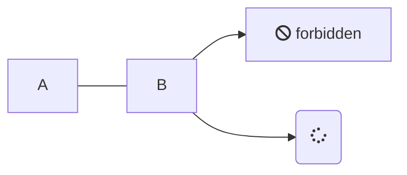

# Unterlagen

## Titel 2

[Docsify](https://docsify.js.org/#/) can generate your documentation-style website on the fly. Unlike GitBook and many other Static Site Generators (SSG), it does not generate static html files. Instead, it smartly loads and parses your Markdown content files and displays them as a website.

> [!NOTE]
> An alert of type 'note' using global style 'callout'.

> [!TIP]
> An alert of type 'tip' using global style 'callout'.

> [!warning]
> An alert of type 'tip' using global style 'callout'.

> [!excercise]
> An alert of type 'tip' using global style 'callout'.

:smile:

